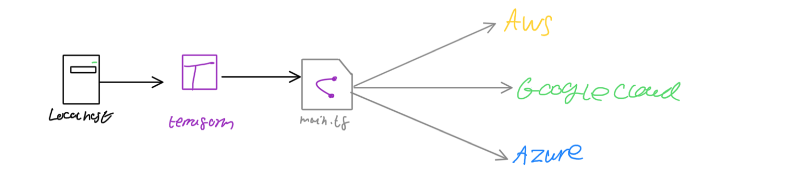

# IAC with [Terraform](https://terraform.io)


## How to setup
- Let's build a script to connect to aws and download/setup all dependencies required
```terraform
provider "aws" {
  region = "eu-west-1"
}
```
- Then we will run terraform init
- Then will move on to launch aws services
- Let's launch an ex2 instance in eu-west-1 with
- Keyword called "resource" provide resource name and give name with specific details to the service
- Resource aws_ex2_instance, name it as eng89_madeline_terraform, ami, type of instance, with or without ip
```terraform
resource "aws_instance" "app_instance" {
  key_name = "your_key_pair" # Specifying an already uploaded key
  ami = "ami-0943382e114f188e8" # Which ami we want to launch
  instance_type = "t2.micro" # Size of instance
  associate_public_ip_address = true
  tags = { # Optional tags
    "Name" = "eng89_madeline_terraform"
  }
}
```
## Most commonly used commands for terraform:
- `terraform plan` checks the syntax and validates the instruction we have provided in this script
- Once we are happy and the outcome is green we could run `terraform apply`

## What is Terraform?
Allows