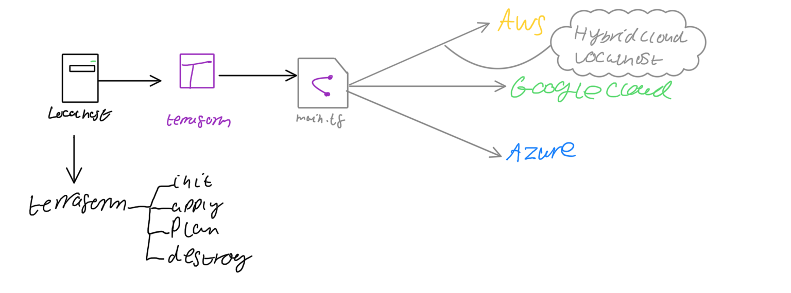

# IAC with Terraform
IaC has two parts:
* Configuration Mangement:
    * Configuration and testing of virtual machines
    * Useful tools: Puppet, Chef and ansible
* Orchestration:
    * Help users in dealing with instances that are already set up and running
    * Useful tools: Terraform, Ansible

## What is Terraform?
* Allows the user to use infrastructure as code for building and managing machines safely and efficiently
* Uses HashiCorp Configuration Language (HCL) or JSON to describe an end state that the user wants for their virtual machines
* Can also be used for rapid prototyping and creation of ami’s

## Why Terraform?
1. Open source: Anyone can contribute and share the code. With a large community new features can be easily added in
2. Agent-less: You don’t need any specialised tools for it to run on the server side, as long as you run it from your machine everything will proceed as normal
3. Immutable infrastructure: If changes are made to already existing instances then instead of creating a new instance Terraform gives you the option to update the existing instances with the new configuration



## Installing Terraform
Make sure to read the [documentation](https://learn.hashicorp.com/tutorials/terraform/install-cli?in=terraform/aws-get-started) for the most up to date steps to install Terraform

## Creating instances with Terraform


⚠️ Please note that I am storing my variables in `variable.tf` and descriptors are being used to fill in the information

### EC2
1. Create your environment variables for your aws access and secret keys in whatever way is best for your platform. For me, I’m using a zsh terminal so I’m going to put my configurations in the `.zshrc` file
2. Create a file called `main.tf` to store your configuration in
3. Perform `terraform init` to being the initialisation of terraform in your directory
4. Set a provider, in this configuration we are going to be using the Ireland server on AWS (also known as `eu-west-1`).
    ```terraform
    provider "aws" {
      region = var.aws_region # Will be filled in automatically with `eu-west-1`
    }
    ```
5. Fill with your preferred configurations. You may want to specify ami's, vpc's, security groups etc. I would recommend reading through the [Terraform registry](https://registry.terraform.io/) to find the documentation/syntax for your provider. But for me I'm using a few configurations. I encoruage you to read through `main.tf` and its comments to get an understanding, however I will walk through some of the most important one here. This is setting up the EC2 instance:
    ```terraform
      resource "aws_instance" "app_instance" {
        key_name = var.aws_key_name # The name of a ssh key already uploaded to AWS
        ami = var.aws_ami_id # The ami that we want to use. I'm using the default Ubuntu 18.04 ami
        instance_type = "t2.micro" # The type of instance you want to run, `t2.micro` is on the free plan
        associate_public_ip_address = true # Set this to false if you don't want a public IP available
        tags = {
          "Name" = "eng89_madeline_terraform" # Just a name tag
        }
      }
    ```
    Quickly looking at the `variable.tf` will reveal the configurations that I'm using, but here's a quick peak:
    ```terraform
    variable "aws_key_name" {
      default = "eng89_madeline_rsa"
    }

    variable "aws_ami_id" {
      default = "ami-0943382e114f188e8"
    } 
    ```
6. Run `terraform plan` to make sure there are no errors
7. Run `terraform apply` to create your instance!

### VPC

For comlpete instructions and information into what a VPC is, I recommend reading through my [VPC Setup](https://github.com/monotiller/engineering89_vpc_setup) repo. But here are the relevant parts to this configuration:

I am using the CIDR block of `10.112.0.0/16`. These are also my security group rules for my web app:

- Inbound:
  | Type       | Protocol | Port range   | Source       | Allow/Deny |
  |------------|----------|--------------|--------------|------------|
  | HTTP (80)  | TCP (6)  | `80`           | `0.0.0.0/0`    | Allow      |
  | SSH (22)   | TCP (6)  | `22`           | `[your ip]/32` | Allow      |
  | Custom TCP | TCP (6)  | `1024 - 65535` | `0.0.0.0/0`    | Allow      |    
- Outbound: allow all traffic

Let's look at some configurations:
- VPC configuration
  ```terraform
    resource "aws_vpc" "prod-vpc" {
      cidr_block = var.aws_cidr_block
      enable_dns_support = true
      enable_dns_hostnames = true
      enable_classiclink = true
      instance_tenancy = "default"

      tags = {
        "Name" = var.aws_vpc_name
      }
    }
  ```
- Subnet configuration
  ```terraform
    resource "aws_subnet" "prod-subnet-public-1" {
      vpc_id = aws_vpc.prod-vpc.id
      cidr_block = var.aws_cidr_block
      map_public_ip_on_launch = true
      availability_zone = var.aws_region

      tags = {
        "Name" = var.aws_subnet_name
      }
    }
  ```
- Internet gateway
  ```terraform
    resource "aws_internet_gateway" "prod-igw" {
      vpc_id = aws_vpc.prod-vpc.id
      tags = {
        Name = var.aws_igw_name
      }
    }
  ```
- Route table
  ```terraform
    resource "aws_route_table" "prod-public-crt" {
      vpc_id = aws_vpc.prod-vpc.id
    }
  ```
- Subnet
  ```terraform
    resource "aws_route_table_association" "prod-crta-public-subnet-1" {
      subnet_id = aws_subnet.prod-subnet-public-1.id
      route_table_id = aws_route_table.prod-public-crt.id
    }
  ```
- Security group
  ```terraform
    resource "aws_security_group" "prod-public-sg" {
        name = var.aws_security_group_name
        description = "Our secruity group"
        vpc_id = aws_vpc.prod-vpc.id
        # All traffic outbound
        egress { 
            from_port = 0
            to_port = 0
            protocol = -1
            cidr_blocks = ["0.0.0.0/0"]
        }

        # Allowing for us to SSH in
        ingress { 
            from_port = 22
            to_port = 22
            protocol = "tcp"
            cidr_blocks = ["0.0.0.0/0"]
        }
        # Allows anyone to connect via HTTP
        ingress { 
            from_port = 80
            to_port = 80
            protocol = "tcp"
            cidr_blocks = ["0.0.0.0/0"]
        }
        # Allows anyone to connect to the node app
        ingress { 
            from_port = 3000
            to_port = 3000
            protocol = "tcp"
            cidr_blocks = ["0.0.0.0/0"]
        }
        tags = {
            "Name" = var.aws_security_group_name
        }
    }
    ```

This should now set up all the correct information for our EC2 instance!
## Useful commands
* terraform init: Prepares your directory with the relevant .terraform folder
* terraform validate: Checks if the configuration is valid
* terraform plan: Checks the syntax and validates the instruction we have provided in this script
* terraform apply: Creates or changes instances
* terraform destroy: Destroy previously-created instances